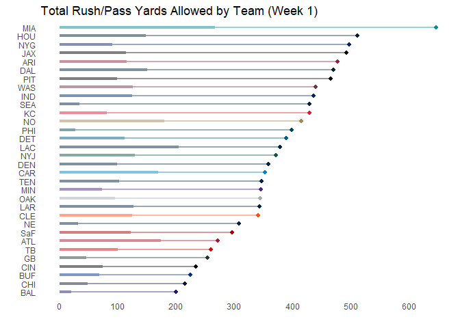
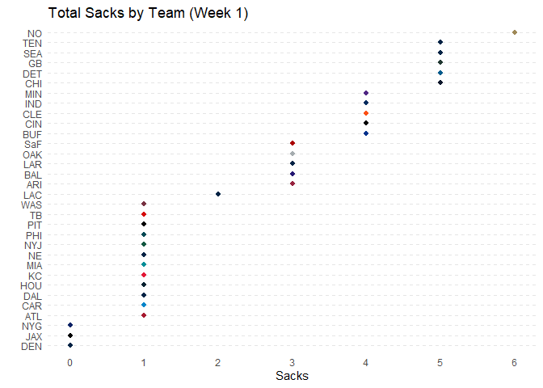

Week 1: Exploration (all teams)
================

We have now looked through a bit of the data that is acquired for a
single game. Now, we use our knowledge of the data structure to make a
couple useful visualizations.

## Setup

``` r
library(DBI) # sql
library(RSQLite) # sql
library(dplyr) # data manipulation
library(ggplot2) # data visualization
library(teamcolors) # actual team colors
source('Functions/get_sql_table.R')
theme_set(theme_bw())

con <- dbConnect(SQLite(), 'NFL') # connect to SQL database

gids <- dbReadTable(conn = con, 'Schedule: Week 1') # info for games
game.ids <- gids$game_id # vector of game ids

##### Vars we need ---------------
myvars <- c('game_id', 'home_team', 'away_team',
            'posteam', 'posteam_type', 'defteam',
            'passer_player_id', 'passer_player_name',
            'play_type', 'yards_gained', 'touchdown', 'desc',
            'sack')

##### Load game ---------------
game.id <- game.ids[1]

large.list <- lapply(game.ids, get_sql_table, myvars, con) # load all games into a list 
df <- do.call(rbind, large.list) # combine list items

glimpse(df)
```

    ## Observations: 1,974
    ## Variables: 13
    ## $ game_id            <chr> "2019090500", "2019090500", "2019090500", "...
    ## $ home_team          <chr> "CHI", "CHI", "CHI", "CHI", "CHI", "CHI", "...
    ## $ away_team          <chr> "GB", "GB", "GB", "GB", "GB", "GB", "GB", "...
    ## $ posteam            <chr> "GB", "GB", "GB", "CHI", "CHI", "CHI", "CHI...
    ## $ posteam_type       <chr> "away", "away", "away", "home", "home", "ho...
    ## $ defteam            <chr> "CHI", "CHI", "CHI", "GB", "GB", "GB", "GB"...
    ## $ passer_player_id   <chr> NA, "00-0023459", "00-0023459", NA, "00-003...
    ## $ passer_player_name <chr> NA, "A.Rodgers", "A.Rodgers", NA, "M.Trubis...
    ## $ play_type          <chr> "run", "pass", "pass", "run", "pass", "run"...
    ## $ yards_gained       <dbl> 0, 0, -10, 5, 0, 7, 0, 1, -6, 0, 0, -7, 4, ...
    ## $ touchdown          <dbl> 0, 0, 0, 0, 0, 0, 0, 0, 0, 0, 0, 0, 0, 0, 0...
    ## $ desc               <chr> "(15:00) A.Jones left tackle to GB 25 for n...
    ## $ sack               <dbl> 0, 0, 1, 0, 0, 0, 0, 0, 1, 0, 0, 1, 0, 0, 0...

#### Who allowed the most yards in week 1?

This graph can also be made using the function `nflplot_yards_allowed`

``` r
## switch sf and sea, la and lac for graphing
df$defteam <- ifelse(df$defteam == 'SF', 'SaF', df$defteam)
df$defteam <- ifelse(df$defteam == 'LA', 'LAR', df$defteam)

##### Summarize data ---------------
df.summ <- df %>%
  group_by(game_id, home_team, away_team, defteam) %>%
  summarize(yards_gained_total = sum(yards_gained)) %>%
  arrange(defteam)

nfl_teamcolors <- teamcolors %>% 
  filter(league == "nfl") %>%
  select(name, primary, division) %>%
  arrange(name)

df.summ$name <- nfl_teamcolors$name

df.summ <- merge(df.summ, nfl_teamcolors, 
                 by = 'name')

##### Pass/Rush points ---------------
df.summ2 <- df %>%
  group_by(game_id, home_team, away_team, defteam, play_type) %>%
  summarize(yards_gained_type = sum(yards_gained))

df.summP <- df.summ2 %>%
  filter(play_type == 'pass') %>%
  rename(yards_gained_pass = yards_gained_type) %>%
  select(-play_type)
  
df.summR <- df.summ2 %>%
  filter(play_type == 'run') %>%
  rename(yards_gained_rush = yards_gained_type) %>%
  select(-play_type)

df.summ <- left_join(df.summ, df.summR)
df.summ <- left_join(df.summ, df.summP)

##### Graph ---------------
clrs <- df.summ[order(df.summ$name),]$primary

### Points 
p <- ggplot(df.summ, aes(x = reorder(defteam, yards_gained_total))) +
  geom_point(aes(y = yards_gained_total), size = 1.75, color = clrs) +
  coord_flip()
  
### Labels and theme
p2 <- p + 
  labs(title = 'Total Rush/Pass Yards Allowed by Team (Week 1)',
       x = '', y = '') +
  # rush yards
  geom_segment(aes(xend = reorder(defteam, yards_gained_total), 
                   y = 0, yend = yards_gained_rush), 
               color = clrs, alpha = 0.5, size = 1.6) +
  # pass yards
  geom_segment(aes(xend = reorder(defteam, yards_gained_total), 
                   y = yards_gained_rush, yend = yards_gained_total), 
               color = clrs, alpha = 0.4, size = 0.8) +
  scale_y_continuous(breaks = c(0, 100, 200, 300, 400, 500, 600)) +
  theme(panel.grid.minor = element_blank(),
        panel.grid.major = element_blank(),
        axis.ticks = element_blank(),
        panel.border = element_blank()
        )

p2
```

<!-- -->

This graph is essentially a combination of a dot plot and a stacked bar
graph. The primary purpose is to show the number of total yards in order
and emphasize the distance of the points from each other. However, we
also have 2 parts that the total yards consists of: rushing and passing.
Since rush yards are almost always lower than pass yards (and if they
are higher, it is not by much), the bar for rushing starts at 0 and
extends to the total yards allowed rushing.

Once we account for the proportion of yards rushing, the rest of the
yards will be from passing. Therefore, the smaller line segment extends
from the rushing yards to total yards (as-opposed to going from 0 to
yards of said type) and represents the proportion of yards a team
allowed on defense from passing plays.

#### Who sacked the QB most frequently?

Sacks are great for fantasy points on defense. For choosing offense, the
number of sacks is partially representative of defensive pressure on the
QB and skill of their opponent’s offensive line.

This graph can also be made from the `df` object using the function
`nflplot_sack_total`

``` r
##### Summarize data ---------------
df.summ <- df %>%
  group_by(game_id, home_team, away_team, defteam) %>%
  summarize(sack_total = sum(sack)) %>%
  arrange(defteam)

df.summ$name <- nfl_teamcolors$name

df.summ <- merge(df.summ, nfl_teamcolors, 
                 by = 'name')

##### Graph ---------------
clrs <- df.summ[order(df.summ$name),]$primary

p <- ggplot(df.summ, aes(x = reorder(defteam, sack_total))) +
  geom_point(aes(y = sack_total), size = 1.75, color = clrs) +
  scale_y_continuous(breaks = seq(min(df.summ$sack_total), max(df.summ$sack_total), 1)) +
  coord_flip()

### Labels and theme
p2 <- p +
    labs(title = 'Total Sacks by Team (Week 1)',
       x = '', y = 'Sacks') +
    theme(panel.grid.minor = element_blank(),
        panel.grid.major.x = element_blank(),
        panel.grid.major.y = element_line(color = 'grey90', linetype = 'dashed'),
        axis.ticks = element_blank(),
        panel.border = element_blank(),
        axis.title.y = element_text(vjust = -.5)
        )

p2
```

<!-- -->

New Orleans were slightly ahead of the pack. In contrast; the Giants,
Jaguars, and Broncos were the biggest slackers in getting to the QB.
