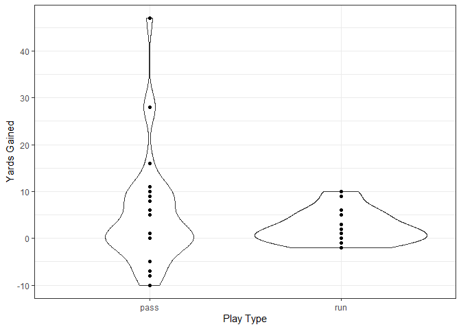

Week 1: Exploration (single team)
================

First we load the game id’s acquired in the `Storing and Loading Data in
SQL` page.

``` r
library(DBI) # sql
library(RSQLite) # sql
library(dplyr) # data manipulation
library(ggplot2) # data visualization
library(teamcolors) # actual team colors
source('Functions/get_sql_table.R')
theme_set(theme_bw())

con <- dbConnect(SQLite(), 'NFL') # connect to SQL database

gids <- dbReadTable(conn = con, 'Schedule: Week 1') # info for games
game.ids <- gids$game_id # vector of game ids

##### Vars we need ---------------
myvars <- c('game_id', 'home_team', 'away_team', 
            'defteam', 'play_type', 'yards_gained', 
            'touchdown', 'desc', 'sack')

##### Load game ---------------
game.id <- game.ids[1]

large.list <- lapply(game.ids, get_sql_table, myvars, con) # load all games into a list 
df <- do.call(rbind, large.list) # combine list items

df <- get_sql_table(game.id = game.id, vars.to.get = myvars, db.con = con)
```

Now, let’s look at how the teams stack up against each other in
performance.

## Packers offense

Finding the frequency of pass plays vs. run plays helps fantasy football
owners make decisions about who to play and who to bench. For example:
on offense, one typically wants to use a runningback on a team that
focuses on the run game. Similarly, a lower quality of the defense
against rushing plays would also help RB’s.

We will start by subsetting a dataframe that shows the defensive plays
for a single team: the Chicago Bears. This isolates plays where we want
to look at the Packers offense or the Bears defense alone. It is always
a good idea to look at a sample represenative to get an idea of how the
rest of the data will look.

``` r
df.bears <- df %>%
  filter(defteam == 'CHI', # def plays for CHI only
         play_type %in% c('run', 'pass')) # only plays against off

perc.pass <- nrow(df.bears[df.bears$play_type == 'pass',]) / (nrow(df.bears[df.bears$play_type == 'pass',]) + nrow(df.bears[df.bears$play_type == 'run',]))
```

So we see that the Packers (the team who played the bears that week) ran
about 55 plays that resulted in a pass or run. About 63.6363636% of
these were passing, with the rest being rushes.

But how many yards per play did each type of play tend to result in?

``` r
##### Add means for geom_hline
df.bears <- df.bears %>%
  group_by(play_type) %>%
  mutate(avg.yds = mean(yards_gained),
         med.yds = median(yards_gained))

ggplot(df.bears) +
  geom_violin(aes(x = play_type, y = yards_gained)) +
  geom_point(aes(x = play_type, y = yards_gained)) +
  labs(x = 'Play Type', y = 'Yards Gained')
```

<!-- -->

The spread of pass play values shown by the violin plot suggests that we
should be weary of outliers when summarizing the data. This isn’t very
surprising because of the different pass types (i.e. small-medium yards
gained on slant routes) and pass plays have a larger chance of a player
making an “explosive” play.

Another potential issue is the spread of values. A quarterback being
sacked or a screen play gone wrong can result in losing more than just a
few yards. But if we look at the data, we can get a more exact answer to
what happened in those plays.

``` r
df.bears %>%
  ungroup() %>%
  filter(play_type == 'pass' & yards_gained < 0) %>%
  select(desc)
```

    ## # A tibble: 6 x 1
    ##   desc                                                                     
    ##   <chr>                                                                    
    ## 1 (13:45) (Shotgun) A.Rodgers sacked at GB 15 for -10 yards (R.Robertson-H~
    ## 2 (8:51) (Shotgun) A.Rodgers sacked at GB 5 for -7 yards (L.Floyd).        
    ## 3 (6:19) (Shotgun) A.Rodgers sacked at GB 26 for -8 yards (A.Hicks).       
    ## 4 (11:43) (Shotgun) A.Rodgers sacked at CHI 47 for -7 yards (L.Floyd).     
    ## 5 (8:16) (Shotgun) A.Rodgers sacked at GB 37 for -5 yards (A.Lynch).       
    ## 6 (7:27) (Shotgun) A.Rodgers pass short left to M.Valdes-Scantling to GB 3~

It looks like the reasons we guessed for negative yards aren’t that
off-base. But should we remove sacks just to help satisfy statistical
assumptions? The answer is: not for most purposes. Plays that result in
negative yards-gained are a part of every NFL game. Further, a loss of
yards also counts towards fantasy football points. The play descriptions
also tell us that Aaron Rodgers was sacked 5 times; a partial indicator
of the effectiveness of Packers’ offensive blocking.

Last for examples on offense, we will find the percent of touchdowns per
play type. Each touchdown provides a large boost in fantasy points.

``` r
df.bears %>%
  group_by(play_type) %>%
  summarize(tds = sum(touchdown)) %>%
  mutate(td.perc = tds / sum(tds))
```

    ## # A tibble: 2 x 3
    ##   play_type   tds td.perc
    ##   <chr>     <dbl>   <dbl>
    ## 1 pass          1       1
    ## 2 run           0       0

This turned out to be a subpar section because the Packers only scored 1
touchdown. That touchdown was a pass. Therefore, as of week 1, the
Packers made 100% of their touchdowns on pass plays.

### Conclusion: offense

In this tutorial, we have found information on the following for the
Packers offense:

  - Percent of plays that are run or pass
      - yards per play of each type
      - touchdowns per play type
  - Number of sacks allowed

## Bears defense

A team’s defense obviously has a direct impact on the opposing team’s
offensive performance. We can use metrics from the Packers offense to
make inferences about the Bears defense. In week 1, the Bears…

  - Allowed <i>x</i> yards per run play. So, on average, we could expect
    the Bears to allow <i>x \* (\# of opposing run plays)</i> per game
    from rushing alone. Yards per pass play is computed the same way.
  - Only allowed 1 touchdown. This is abnormal, so we want to avoid
    putting too much certainty into this finding
  - Sacked the opposing QB 5 times

## Up next

In this example, we looked at information for a single game. This helps
us get a feel for the data, which is important because each game in each
week has the same format. In the next markdown, I will give examples of
visualizing all teams.
